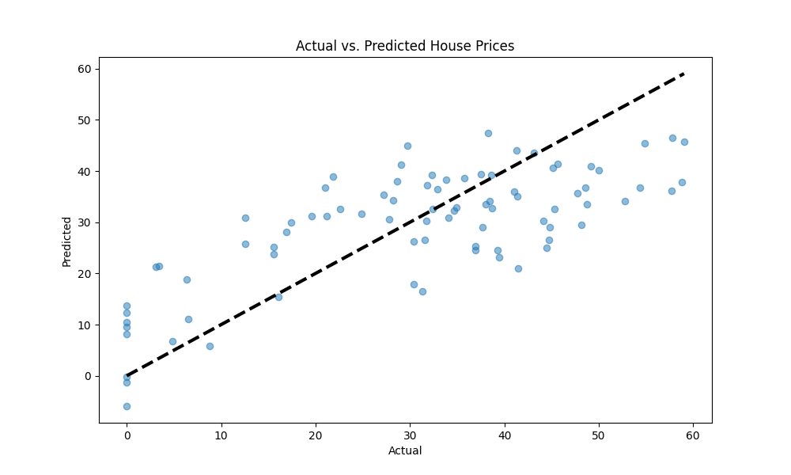

# a_simple_ml_model
A Machine Learning (ML) model is a mathematical representation of patterns and relationships found in data.
# Linear Regression Model for House Price Prediction

This project demonstrates a simple Linear Regression model to predict house prices based on key features such as the distance to the nearest MRT station, the number of convenience stores nearby, and geographical coordinates (latitude and longitude).

## Dataset
The dataset used in this project is `Real_Estate.csv`, which contains information about different houses and their respective features.

## Requirements
Before running the code, install the required dependencies:

```bash
pip install pandas scikit-learn matplotlib tabulate
```

## Code Explanation

### Importing Libraries
The following libraries are used in the project:

- `pandas` for data manipulation
- `matplotlib.pyplot` for visualization
- `scikit-learn` for machine learning operations such as model training and evaluation
- `utils.show_dataset_full` (custom function) to display the dataset

```python
import pandas as pd
import matplotlib.pyplot as plot
from sklearn.model_selection import train_test_split
from sklearn.linear_model import LinearRegression
from sklearn.metrics import mean_squared_error, r2_score
from utils import show_dataset_full
```

### Loading the Dataset
The dataset is loaded using Pandas:

```python
real_estate_data = pd.read_csv("D:/my_github_projects/a_simple_ml_model/Real_Estate.csv")
```

### Displaying the Dataset (Optional)
To print the dataset in a tabular format:

```python
print(show_dataset_full(real_estate_data).to_string())
```

Alternatively, for Markdown formatting:

```python
# Install tabulate for Markdown formatting
pip install tabulate
print(show_dataset_full(real_estate_data).to_markdown())
```

### Selecting Features and Target Variable

```python
features = ["Distance to the nearest MRT station", "Number of convenience stores", "Latitude", "Longitude"]
target = "House price of unit area"
X = real_estate_data[features]  # Feature columns
y = real_estate_data[target]    # Target variable
```

### Splitting the Data into Training and Testing Sets

```python
X_train, X_test, y_train, y_test = train_test_split(X, y, test_size=0.2, random_state=42)
```

### Model Selection
We use a Linear Regression model because:

1. It is simple and interpretable.
2. It assumes a linear relationship between the features and the target variable.
3. It is computationally efficient.
4. It serves as a good baseline model for comparison.

```python
model = LinearRegression()
model.fit(X_train, y_train)
```

### Making Predictions

```python
y_pred_linear_regression = model.predict(X_test)
```

### Visualization: Actual vs. Predicted House Prices

To visualize the model's performance, we plot actual vs. predicted house prices:

```python
plot.figure(figsize=(10, 6))
plot.scatter(y_test, y_pred_linear_regression, alpha=0.5)
plot.plot([y_test.min(), y_test.max()], [y_test.min(), y_test.max()], "k--", lw=3)
plot.xlabel("Actual")
plot.ylabel("Predicted")
plot.title("Actual vs. Predicted House Prices")
plot.gcf().canvas.manager.set_window_title("Linear Regression Model: Prediction Accuracy")
plot.show()
```

### Model Performance Evaluation

To evaluate the model, we use:

```python
mse = mean_squared_error(y_test, y_pred_linear_regression)
r2 = r2_score(y_test, y_pred_linear_regression)
print(f"Mean Squared Error: {mse}")
print(f"R^2 Score: {r2}")
```

## Results
Below is the scatter plot visualization of actual vs. predicted house prices:




## Error Metrics in Linear Regression

📝Note

### Mean Squared Error (MSE)
The **Mean Squared Error (MSE)** measures the average squared difference between actual and predicted values. It quantifies how far the model's predictions deviate from the true values.

MSE = (1/n) ∑ (y<sub>actual</sub> - y<sub>predicted</sub>)²

where: 
- (y_actual) are the real house prices,  
- (y_predicted) are the model's predicted prices,  
- (n) is the number of observations.  

**A lower MSE indicates a better-performing model.**


### R² Score (Coefficient of Determination)
The **R² Score** evaluates how well the model explains the variance in the target variable. It compares the model's predictions to a simple mean-based prediction.

R² = 1 - [ Σ (y_actual - y_predicted)² ] / [ Σ (y_actual - ȳ)² ]

where:
- **y_actual** are the real house prices.
- **y_predicted** are the model's predicted prices.
- **ȳ (y-bar)** is the mean of the actual values.

#### Interpretation:
- **1.0** → Perfect fit (model explains all variance in data).
- **0.0** → Model performs no better than predicting the mean.
- **Negative values** → Model performs worse than a naive prediction.

**A higher R² score indicates a better fit.**


## Conclusion
This project demonstrates a basic implementation of a Linear Regression model for house price prediction. Further improvements can be made by:

- Experimenting with more features.
- Using different machine learning models for comparison.
- Performing feature engineering and hyperparameter tuning.

### Mean Squared Error (MSE)
The **Mean Squared Error (MSE)** measures the average squared difference between actual and predicted values. It quantifies how far the model's predictions deviate from the true values.

MSE = (1/n) ∑<sub>i=1</sub><sup>n</sup> (y<sub>actual,i</sub> - y<sub>predicted,i</sub>)²

📝 **Note:** A lower MSE indicates a better-performing model.


